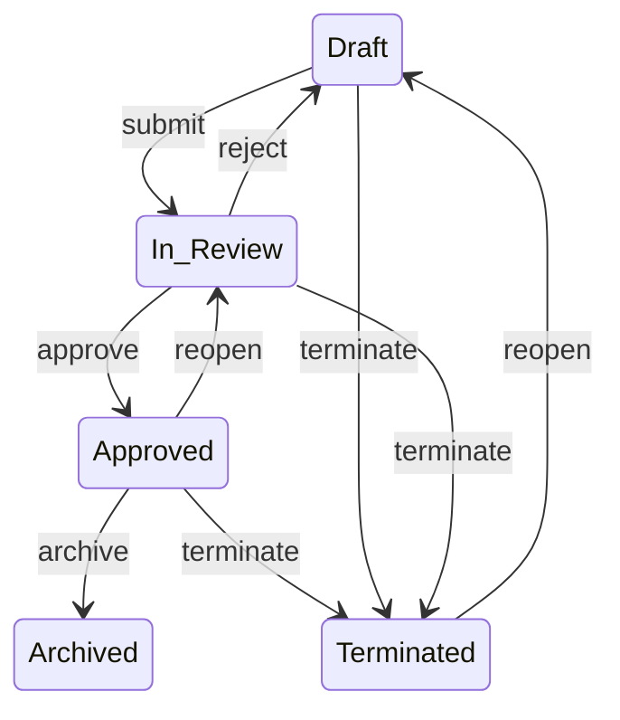

# Document Lifecycle

## Mermaid Diagram

## Key Design Properties

- **Archived** and **Terminated** are **terminal states**
- **Terminate** is a _global operation_ available from all active states
- The model cleanly supports **early exits** without corrupting the review lifecycle

## Formal State Transition Table

### Legend

- ✅ = valid transition
- ❌ = invalid / not allowed
- — = no transition (terminal)

| Current State  | submit | approve | reject | archive | terminate | reopen | Next State(s)                                                            |
|----------------|--------|---------|--------|---------|-----------|--------|--------------------------------------------------------------------------|
| **Draft**      | ✅      | ❌       | ❌      | ❌       | ✅         | ❌      | `submit → In Review` `terminate → Terminated`                         |
| **In Review**  | ❌      | ✅       | ✅      | ❌       | ✅         | ❌      | `approve → Approved` `reject → Draft` `terminate → Terminated`     |
| **Approved**   | ❌      | ❌       | ❌      | ✅       | ✅         | ✅      | `archive → Archived` `terminate → Terminated` `reopen → In Review` |
| **Archived**   | ❌      | ❌       | ❌      | ❌       | ❌         | ❌      | **No outgoing transitions**                                              |
| **Terminated** | ❌      | ❌       | ❌      | ❌       | ❌         | ✅      | `reopen → Draft`                                                         |

## Normalized Transition Matrix (One Row per Transition)

| From State | Operation | To State   |
|------------|-----------|------------|
| Draft      | submit    | In Review  |
| Draft      | terminate | Terminated |
| In Review  | approve   | Approved   |
| In Review  | reject    | Draft      |
| In Review  | terminate | Terminated |
| Approved   | archive   | Archived   |
| Approved   | terminate | Terminated |
| Approved   | reopen    | In Review  |
| Terminated | reopen    | Draft      |
